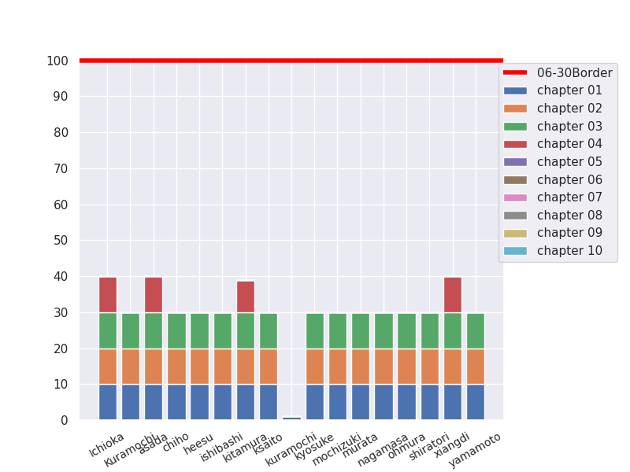

# NLP100本ノック2026 (See English Below)

小町研・欅研の2026年度新入生に向けた勉強会として、[言語処理100本ノック](https://nlp100.github.io/2025/ja/index.html)に取り組みます。


予習として、毎週1章（10問）の問題を解いてきてください（初回を除く）。

勉強会の時間には、事前に割り当てられた問題を解説していただきます。

## 使い方

初回はこのレポジトリを Clone してください。

```
$ git clone https://github.com/SDS-NLP/100knock2026.git
```

プログラムを次のディレクトリ形式で保存してください: <名前>/chapter<XX>/knock<XX>.py (e.g., `komachi/chapter01/knock01.py`)

下記の手順により、プログラムを Remote Repository に Push してください。

**この際、 `git push origin main` としないように注意してください（他の人のデータが消えてしまう危険性があるため）。**

```
$ git branch <名前(以下、b_name)> (e.g., git branch komachi)
$ git checkout <b_name>
$ git add <任意のファイル・フォルダ> (e.g., git add ./komachi/chapter01/knock01.py)
$ git commit -m '<your message>' (e.g., git commit -m 'komachi: 00-09')
$ git pull origin main
$ git push origin <b_name>
```

## 注意事項

新入生は可能な限り Python3 系で書いてください。

つまずいた場合は Slack チャンネルで**積極的に**質問してください。

**他の人のディレクトリを変更することは絶対にやめてください**（他の人のコードを閲覧したい場合は、Web サイト上から閲覧してください）。

chapter##/knockXX.py のフォルダ名とファイル名を間違えると進捗グラフに反映されません。

## みんなの進捗




# 100 NLP Exercises 2026

We will work on the [100 Language Processing Exercises](https://nlp100.github.io/2025/ja/index.html) as a study group for new students in Komachi Lab and Keyaki Lab in 2026.

As preparation, please solve one chapter (10 questions) each week, except for the first session.

During the study group, you will explain the questions assigned to you in advance.

## Usage

You should clone this repository the first time.

```
$ git clone https://github.com/SDS-NLP/100knock2026.git
```

Please save your program in the following directory format: `<name>/chapter<XX>/knock<XX>.py` (e.g., `komachi/chapter01/knock01.py`)

Then push your program to the remote repository by following the steps below.

**Be careful not to run `git push origin main`, because doing so may overwrite other people's work.**

```
$ git branch <any branch name(b_name)> (e.g., git branch komachi)
$ git checkout <b_name>
$ git add <any file or folder> (e.g., git add ./komachi/chapter01/knock01.py)
$ git commit -m '<your message>' (e.g., git commit -m 'komachi: 00-09')
$ git pull origin main
$ git push origin <b_name>
```

## Notes

If possible, please use Python 3.

If you get stuck, ask questions **proactively** in the Slack channel.

**Do not modify other people's directories.** (If you want to look at someone else's code, please view it on the website.)

If the directory name or file name such as `chapter##/knockXX.py` is incorrect, it will not be reflected in the progress graph.

## Everyone's Progress


